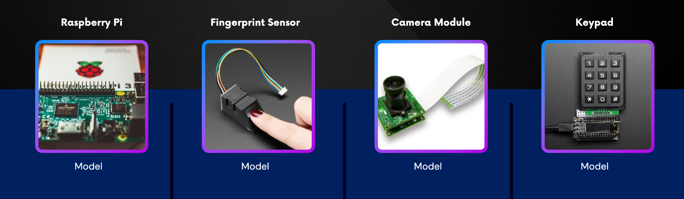

[comment]: # "This is the standard layout for the project, but you can clean this and use your own template"

# ATTENDANCE MONITORING AND ACCESS AUTHENTICATION WITH FACE RECOGNITION 
---

## Team
-  E/19/278, Tharudi, [email](mailto:e19278@eng.pdn.ac.lk)
-  E/19/295, Janitha, [email](mailto:e19295@eng.pdn.ac.lk)
-  E/19/300, Asela, [email](mailto:e19300@eng.pdn.ac.lk)
-  E/19/452, Ashan, [email](mailto:e19452@eng.pdn.ac.lk)
-  E/19/492, Nuwantha, [email](mailto:e19492@eng.pdn.ac.lk)

<!-- Image (photo/drawing of the final hardware) should be here -->

<!-- This is a sample image, to show how to add images to your page. To learn more options, please refer [this](https://projects.ce.pdn.ac.lk/docs/faq/how-to-add-an-image/) -->

<!--  -->

#### Table of Contents
1. [Problem Overview](#problem-overview)
2. [Why is this need?](#detailed-budget)
3. [Solution Architecture](#solution-architecture)
4. [Infrastructure](#infrastructure)
5. [BOM](#bom)
6. [Extendibility & Scalability](#extendibility)
7. [Links](#links)

## 1.Problem Overview
Deficiencies of Manual Attendance Management System​
+ Time-Consuming Process​
+ Prone to Errors​
+ Lack of Real-Time Data​
+ Bureaucratic Hassles​
+ Limited Scalability​
+ Security Concerns​
 
## 2.Why is this need?
+ Efficiency in Tracking With Face Detection​
+ Multi Security Levels​
+ Error Reduction​
+ Real-Time Updates​
+ Streamlined Administration​
+ Scalability​
+ Enhanced Security
  
## 3.Solution Architecture
+ ###  High-Level Overview
  
  Out attendance management System has 3 tiers
+ Attendance Management Device
+ Backend Server
+ Frontend Dashboards (User & Admin)
  
+ ### Roles of the System

### 1.Admin
Admin can add and remove employees
See the employee details (image, name, absent date)
Unauthorized person entering alert (optional)

To access the admin dashboard

Should have a current date attendance tracked by face detection
Fingerprint access or keypad

  ### 2. Employees

Attendance marks either face detection or fingerprint
They have their profile to see their attendance

   ### 3. Manager
Manages teams or departments.
Monitors employee attendance and performance.
May receive real-time notifications about attendance events.

+ ### Control Flow of the System
  
+ ### Data Flow of the System
  

## 4.Infrastructure
+ ### Technology Stack

+ ### Hardware Components

## 5.BOM
## 6.Extendibility & Scalability

## Links

- [Project Repository]( page.repository-name }}){:target="_blank"}
- [Project Page]( page.repository-name }}){:target="_blank"}
- [Department of Computer Engineering](http://www.ce.pdn.ac.lk/)
- [University of Peradeniya](https://eng.pdn.ac.lk/)

[//]: # (Please refer this to learn more about Markdown syntax)
[//]: # (https://github.com/adam-p/markdown-here/wiki/Markdown-Cheatsheet)
